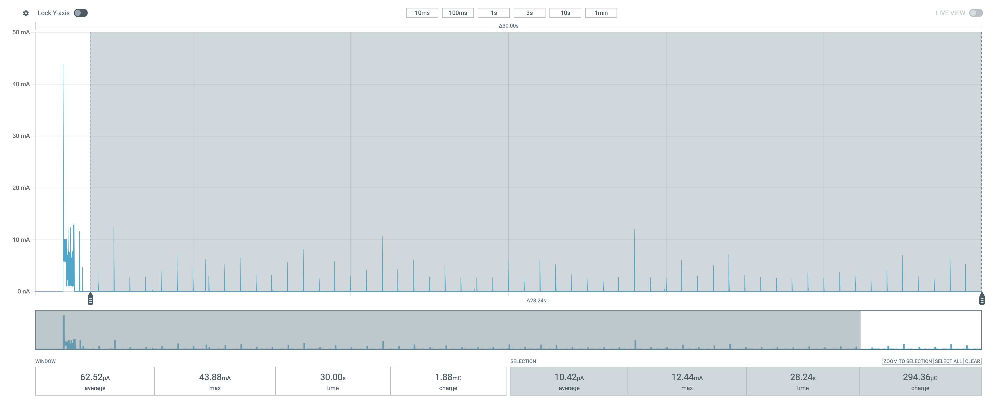

# embr
## Edge AI Voice Control for Thread Smart Lighting

<p align="center">
  
  
</p>

[](https://github.com/john-rom/ember/actions/workflows/run-unit-tests.yaml)


**embr** is a wireless, embedded voice-control system built to make lighting respond quickly and naturally. It wakes on command, 
processes your voice locally, and triggers lighting changes in milliseconds, all designed around low power, real-time technology.

It combines on-device keyword detection with Thread networking to deliver responsive smart-light control across a local mesh. 
And **embr** is just one part of a broader Edge AI platform aimed at enabling practical Matter device control wherever you need it.

**embr** integrates with **harth**, a bespoke Matter bridge currently in active development. Over time, **harth** is intended to 
connect with an entire set of drop-in AI modules to support autonomous, intelligent, and safe control of your favorite spaces.

## Motivation
Voice control for lighting should feel intuitive, instant, and dependable. Relying on cloud services, Wi-Fi stability, or a vendor mobile 
app adds latency, fragility, and inconvenience to something that should “just work.” **embr** is a local-first embedded project exploring 
on-device keyword detection paired with Thread-native control paths. An Edge AI-powered core and a clean boundary to Matter-enabled 
devices allows for fast, private control that remains interoperable as the system expands.

This repository is an incremental migration from a working prototype into a clean, testable codebase. The current public baseline focuses on bring-up, 
platform seams, and unit tests; additional modules and the end-to-end voice pipeline will land here as they are refactored and integrated.

## Status + Roadmap
### Implemented
- Essential board and Zephyr RTOS bring-up, with logging over SEGGER RTT
- Early hardware bring-up: functional GPIO wrapper and LED modules
- Minimal application lifecycle API, running blinky on-device
- Unit testing infrastructure: Zephyr's Twister runs unit tests with mocks using the Ztest framework
- Continuous Integration: GitHub Actions workflow up and running via self-hosted runner, unit tests green
- Basic Doxygen documentation

### Next
- Baseline and ongoing power profiling with PPK2
- DMIC bring-up and abstraction; validation of wake-on-sound capability

### Planned
- Edge Impulse wrapper with local model integration + stubbing for CI
- Application-level modules: inference + command mapping
- Minimal inference pipeline evaluation:
  - voice command → DMIC → EI inference → lighting command → on-board LED
- Track resource metrics, telemetry, and performance benchmarking
- Thread networking integration with CoAP client messaging
- Companion translator node (separate device/firmware; developed concurrently):
  - CoAP server endpoint → Matter cluster commands
- End-to-end system demo:
  - voice command → Matter/Thread smart bulb control (wireless)

## Power Profile
Baseline power measurements were captured on a Nordic Thingy:53 using the Nordic Power Profiler Kit II (PPK2), which powered the device under test.

| Profile | Avg Current | Peak Current | Notes |
|---|---:|---:|---|
| LED Blink Baseline | 10.46 µA | 13.60 mA | Mean of 3 trials (steady-state after init settles) |

<figure>
  
  <figcaption><em>PPK2 capture showing steady-state LED blink current after init settles (selection window).</em></figcaption>
</figure>
<p></p>Full measurement notes and screenshots: [docs/power.md](docs/power.md)

## Repository layout
- `.github/workflows/` → CI workflows
- `app/` → application logic and features
- `docs/` → documentation and README assets (images, diagrams)
- `platform/` → platform abstractions (drivers, wrappers, portability seams)
- `src/` → application entry points / glue code
- `tests/unit/` → unit tests executed via Zephyr's Twister
- `CMakeLists.txt` → CMake build configuration
- `Doxyfile` → Doxygen documentation configuration
- `prj.conf` → application configuration

## Building/Flashing
### Requirements
- nRF Connect SDK (NCS) v2.4.0 (version used in development)
- Zephyr Toolchain with west metatool [included with NCS]
- Nordic Semiconductor Thingy:53
- Compatible Nordic Development Kit or SEGGER J-Link debugger
  - Alternatively, the nRF Connect Programmer App (if flashing via DFU)

### Build
From the project root directory:
```text
west build -p -b thingy53_nrf5340_cpuapp
```
This will do a pristine build for the Thingy:53 target board (assuming a secure deployment environment).

### Flash
Connect the Thingy:53 to the Nordic DK’s J-Link DEBUG OUT header using a 10-pin 1.27 mm ARM Cortex-M SWD ribbon cable.

From the project root directory:
```text
west flash
```
Alternatively, the `dfu_application.zip` file created in `build/zephyr` can be programmed onto the Thingy:53 via Nordic's nRF Connect Programmer application.

## Unit Tests
Unit tests live under `tests/unit` and are executed via Zephyr's Twister test runner.

From the project root directory:
```text
west twister -T tests/unit
```

## Software Stack
- **Language**: C/C++
- **Firmware base**: Zephyr RTOS (via nRF Connect SDK v2.4.0)
- **Voice pipeline (in progress)**: DMIC/PDM audio capture → buffering/feature extraction → command mapping
- **On-device inference (planned)**: Edge Impulse runtime integration (keyword model) behind a thin wrapper layer (CI-stubbable)
- **Networking (planned)**: Thread via OpenThread + CoAP messaging for local control paths
- **Matter boundary**: Integrates with **harth** (Thread-side messages translated to Matter cluster operations)

## Project Hardware
### Nordic Semiconductor:
  - **Thingy:53, running custom 'embr' application firmware**:
    - nRF5340 SoC:
      - Application Core: 128 MHz Arm Cortex-M33 CPU [1 MB Flash + 512 KB RAM]
      - Network Core: 64 MHz Arm Cortex-M33 CPU [256 KB Flash + 64 KB RAM]
  - **nRF52840-Dongle, running vendor OpenThread Radio Co-Processor (RCP) firmware**:
    - nRF52840 SoC:
      - 64 MHz Arm Cortex-M4 with FPU [1 MB Flash, 256 KB RAM]
  - **nRF54L15-DK, running custom 'harth' bridge firmware**:
    - nRF54L15 SoC:
      - 128 MHz Arm Cortex-M33 [1.5 MB NVM, 256 KB RAM]
  - **Power Profiler Kit II (PPK2)**:
    - used to measure, quantify, and visualize power consumption during development and application runtime:
    - 200nA to 1A measurement range
  
### Nanoleaf:
  - Essentials A19/E26 Matter/Thread Smart Bulb

### Development Hosts:
- **Matter controller host**: runs chip-tool for commissioning/testing
- **Thread border router host**: runs OTBR (Docker) + manages the Thread network; connected to nRF52840-Dongle with RCP firmware

## Tooling
### Build & configuration
- **west**: Zephyr/NCS workspace + build/flash wrapper
- **CMake + Ninja**: build system + fast backend generator
- **Kconfig**: feature and compile-time configuration menus/options
- **Devicetree (DTS)**: hardware description (pins, buses, peripherals)

### Debug & flash
- **SEGGER J-Link**: SWD debug probe used by Nordic DKs
- **RTT (Real-Time Transfer)**: low-overhead debug logging over J-Link
- **nrfjprog / nrfutil**: Nordic flashing, provisioning, and DFU utilities (as needed)
- **west flash / debug** — standard Zephyr commands for flashing + debugging

### Matter (Connectivity Standards Alliance)
- **chip-tool**: CLI Matter controller for commissioning/testing devices
- **ZAP (ZCL Advanced Platform)**: generates Matter cluster/attribute code from data models

### Thread
- **OpenThread Border Router (Docker)**: local Thread network + commissioning environment

### Test & CI
- **Twister**: Zephyr's test runner for unit/integration tests
- **Ztest**: Zephyr’s unit test framework
- **GitHub Actions**: CI for builds/tests on pushes and pull requests
- **Docker**: pinned, reproducible toolchain environment (NCS/Zephyr)

## Model Artifacts
This repository will not include model artifacts, as the intent is simply to keep the public repo buildable for review, platform work, 
tests, and system integration.
