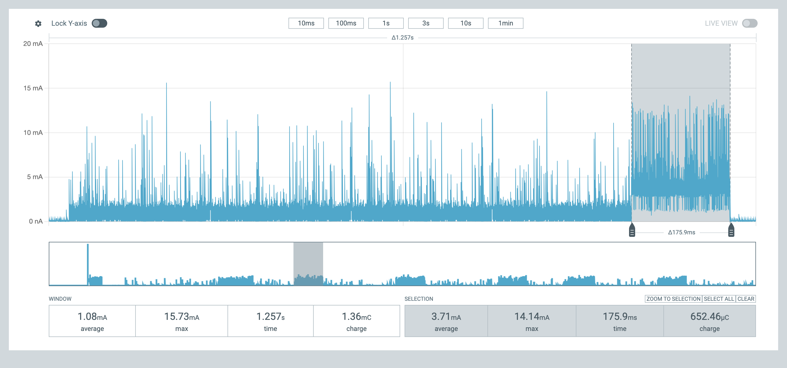

# embr
## Edge AI Voice Control for Thread Smart Lighting

[](https://github.com/john-rom/ember/actions/workflows/run-unit-tests.yaml)
[](https://github.com/john-rom/embr/actions/workflows/run-build.yaml)
[](LICENSE)

<p align="center">
  
  
</p>

**embr** is a wireless, embedded voice-control system built to make Matter-enabled lighting respond quickly and naturally. It wakes on command, 
processes your voice locally, and triggers lighting changes in milliseconds, all designed around low power, real-time technology.

It combines on-device keyword detection with Thread networking to deliver responsive smart-light control across a local mesh. 
And **embr** is just one part of a broader Edge AI platform aimed at enabling practical Matter device control wherever you need it.

**embr** integrates with **harth**, a bespoke Matter bridge currently in active development. Over time, **harth** is intended to 
connect with an entire set of drop-in AI modules to support autonomous, intelligent, and safe control of your favorite spaces.

## Status + Roadmap
  ### Implemented
  - Core board bring-up, logging, and platform wrappers (GPIO/LED/mic)
  - WOS-triggered DMIC capture window + mic lifecycle controls (start/stop/reset/deinit)
  - Edge Impulse wrapper integration with public stub backend and local real-model override
  - Inference capture pipeline + classification label mapping + command selection
  - Unit tests (Twister/Ztest), CI, and focused coverage for platform/inference/logic layers
  - PPK2 power baselines (blinky, DMIC continuous capture, DMIC WOS events)
  - WOS capture window validation, via power profiling

  ### Next
  - Thread networking integration for command transport
  - CoAP client path for transmitting inferred commands
  - NFC-assisted or otherwise streamlined Thread commissioning/provisioning
  - App-level integration testing of the Zephyr runtime shell (`embr_app`)

  ### Planned
  - Track resource metrics, telemetry, and performance benchmarking
  - Companion translator node (separate device/firmware; developed concurrently):
      - CoAP server endpoint → Matter cluster commands
  - End-to-end system demo:
      - voice command → on-device inference → Thread/CoAP message → Matter/Thread smart bulb control

## Motivation
Voice control for lighting should feel intuitive, instant, and dependable. Relying on cloud services, Wi-Fi stability, or a vendor mobile 
app adds latency, fragility, and inconvenience to something that should "just work". **embr** is a local-first embedded project exploring 
on-device keyword detection paired with Thread-native control paths. An Edge AI-powered core and a clean boundary to Matter-enabled 
devices allows for fast, private control that remains interoperable as the system expands.

This repository is an incremental migration from a working prototype into a clean, testable codebase. The current public baseline includes bring-up,
platform seams, a local inference pipeline with a public stub/default build path, and focused unit coverage across key platform and app modules;
additional integration work and the full end-to-end system path will land here as they are refactored and integrated.

## Repository layout
- `.github/workflows/` → CI workflows
- `app/` → application logic and features
- `boards/` → board-specific overlays and build configuration
- `docs/` → documentation and README assets (images, diagrams)
- `platform/` → platform abstractions (drivers, wrappers, portability seams)
- `scripts/` → helper scripts (docs, tooling)
- `src/` → application entry points / glue code
- `tests/unit/` → unit tests executed via Zephyr's Twister
- `third_party/` → external dependencies and vendor libraries
- `CMakeLists.txt` → CMake build configuration
- `Doxyfile` → Doxygen documentation configuration
- `prj.conf` → Kconfig application configuration

## Building/Flashing
### Requirements
- nRF Connect SDK (NCS) v2.4.0 (version used in development)
- Zephyr Toolchain with west metatool [included with NCS]
- Nordic Semiconductor Thingy:53
- Compatible Nordic Development Kit or SEGGER J-Link debugger
  - Alternatively, the nRF Connect Programmer App (if flashing via DFU)

### Build
From the project root directory:
```text
west build -p always -b thingy53_nrf5340_cpuapp
```
This will do a pristine build for the Thingy:53 target board (assuming a secure deployment environment).

### Edge Impulse Build Modes
The default/public build uses a stub `ei_wrap` backend and does not require
private Edge Impulse deployment files.

To enable the real Edge Impulse-backed build locally, create a
`prj.local.conf` file at the repo root with:

```conf
CONFIG_EDGE_IMPULSE=y
CONFIG_EDGE_IMPULSE_URI="third_party/edge_impulse/embr"
CONFIG_EI_WRAPPER_DATA_BUF_SIZE=32001
```

`prj.local.conf` is gitignored and intended for local/private overrides only.
You must also provide the corresponding Edge Impulse deployment files locally
under the configured URI path.

Build the real Edge Impulse-backed local configuration with:

```text
west build -p always -b thingy53_nrf5340_cpuapp -- -DEXTRA_CONF_FILE=prj.local.conf
```

When `CONFIG_EDGE_IMPULSE` is not enabled, the firmware builds and runs with a
deterministic stub inference backend that emits an `unknown` result.

### Edge Impulse Model Compatibility
The default/public build uses a stub inference backend. If you want to replace
it with a real Edge Impulse deployment, your local model must match the app's
label and timing contract.

See [docs/edge_impulse.md](docs/edge_impulse.md) for the required labels and
audio/inference parameters.

### Flash
Connect the Thingy:53 to the Nordic DK's J-Link DEBUG OUT header using a 10-pin, 2x5 1.27 mm IDC (SWD) ribbon cable.

From the project root directory:
```text
west flash
```
Alternatively, the `dfu_application.zip` file created in `build/zephyr` can be programmed onto the Thingy:53 via Nordic's nRF Connect Programmer application.

## Unit Tests
Unit tests live under `tests/unit` and are executed via Zephyr's Twister test runner.

From the project root directory:
```text
west twister -T tests/unit
```

## Power Profile
<p align="center">
<figure>
  
  <figcaption><em>Thingy:53 connected to the PPK2 via the current measurement and debug board.</em></figcaption>
</figure>
</p>
<p></p>
Baseline power measurements were captured on a Nordic Thingy:53 using the Nordic Power Profiler Kit II (PPK2), which powered the device under test.
<p></p>

| Profile | Avg Current | Peak Current | Notes |
|---|---:|---:|---|
| LED Blink Baseline | 10.46 µA | 13.60 mA | Mean of 3 trials; steady-state after init settles |
| DMIC Continuous Capture | 646.08 µA | 16.70 mA | Mean of 3 trials; 16 kHz mono PDM capture, no sleep/idle |
| WOS Armed Idle | 101.44 µA | 11.33 mA | Mean of 3 idle trials; 26.85 s windows, no wake events |
| WOS Wake Event | 673.25 µA | 14.83 mA | Mean of 6 wake selections; ~1.006 s active capture window per wake |
| WOS + DSP/Inference Armed Idle | 96.24 µA | 12.83 mA | Mean of 3 idle trials; 26.85 s windows, no wake events |
| WOS + DSP/Inference Event | 1.154 mA | 16.34 mA | Mean of 3 combined event selections; ~1.175 s capture + DSP/inference window |

<figure>
  
  <figcaption><em>DSP/Inference event (selected region) showing ~176 ms active DSP/inference window.</em></figcaption>
</figure>
<p></p>

Full measurement notes and screenshots: [docs/power.md](docs/power.md)

## Software Stack
- **Language**: C
- **Firmware base**: Zephyr RTOS (via nRF Connect SDK v2.4.0)
- **Voice pipeline**: DMIC/PDM audio capture → buffering → on-device inference → command mapping
- **On-device inference**: Edge Impulse integration behind a thin wrapper with a public stub/default backend and local real-model override
- **Networking (planned)**: Thread via OpenThread + CoAP messaging for local control paths
- **Matter boundary**: Integrates with **harth** (Thread-side messages translated to Matter cluster operations)

## Project Hardware
### Nordic Semiconductor:
  - **Thingy:53, running custom 'embr' application firmware**:
    - nRF5340 SoC:
      - Application Core: 128 MHz Arm Cortex-M33 CPU [1 MB Flash + 512 KB RAM]
      - Network Core: 64 MHz Arm Cortex-M33 CPU [256 KB Flash + 64 KB RAM]
  - **nRF52840-Dongle, running vendor OpenThread Radio Co-Processor (RCP) firmware**:
    - nRF52840 SoC:
      - 64 MHz Arm Cortex-M4 with FPU [1 MB Flash, 256 KB RAM]
  - **nRF54L15-DK, running custom 'harth' bridge firmware**:
    - nRF54L15 SoC:
      - 128 MHz Arm Cortex-M33 [1.5 MB NVM, 256 KB RAM]
  - **Power Profiler Kit II (PPK2)**:
    - used to measure, quantify, and visualize power consumption during development and application runtime:
    - 200nA to 1A measurement range

### Nanoleaf:
  - Essentials A19/E26 Matter/Thread Smart Bulb

### Development Hosts:
- **Matter controller host**: runs chip-tool for commissioning/testing
- **Thread border router host**: runs OTBR (Docker) + manages the Thread network; connected to nRF52840-Dongle with RCP firmware

## Tooling
### Build & configuration
- **west**: Zephyr/NCS workspace management + build/flash/debug wrapper
- **CMake + Ninja**: build system + fast backend generator
- **Kconfig**: feature and compile-time configuration menus/options
- **Devicetree (DTS)**: hardware description (pins, buses, peripherals)

### Debug & flash
- **SEGGER J-Link**: SWD debug probe used by Nordic DKs
- **RTT (Real-Time Transfer)**: low-overhead debug logging over J-Link
- **nrfjprog / nrfutil**: Nordic flashing, provisioning, and DFU utilities (as needed)
- **GDB**: via `west debug` command

### Matter (Connectivity Standards Alliance)
- **chip-tool**: CLI Matter controller for commissioning/testing devices
- **ZAP (ZCL Advanced Platform)**: generates Matter cluster/attribute code from data model
  - Used when implementing **harth**, but included here as a system development tool

### Thread
- **OpenThread Border Router (Docker)**: local Thread network + commissioning environment

### Test & CI
- **Twister**: Zephyr's test runner for unit/integration tests
- **Ztest**: Zephyr's unit test framework
- **GitHub Actions**: CI for builds/tests on pushes and pull requests
- **Docker**: pinned, reproducible toolchain environment (NCS v2.4.0 + Zephyr)

## Model Artifacts
This repository does not include private Edge Impulse model artifacts. The
public/default build remains usable through a stub inference backend, while
local real-model builds are enabled separately through `prj.local.conf` and a
local Edge Impulse deployment.
