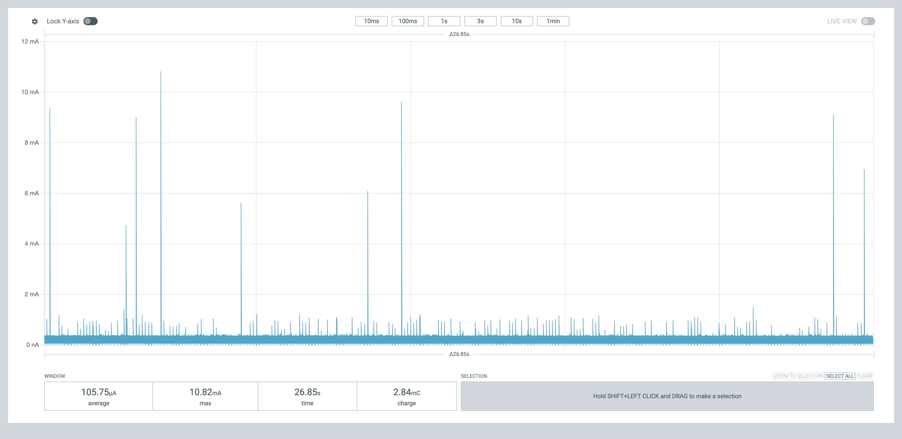
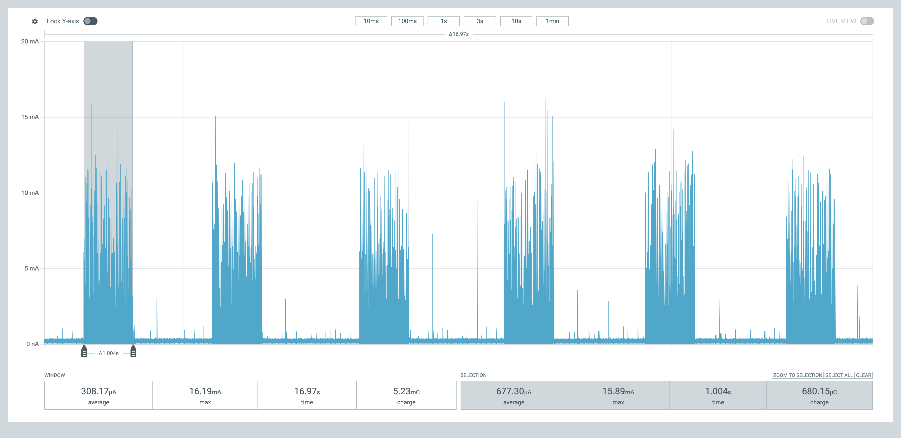

# Power Report
This document contains power profiling results for **embr**, captured with the **Nordic Power Profiler Kit II (PPK2)**.
Values are intended to provide a repeatable baseline and enable apples-to-apples comparison as features are added
(e.g., DMIC bring-up, wake-on-sound (WOS) + inference bursts, Thread/Matter activity).

---

## Measurement Setup
<figure>
  
  <figcaption><em>Thingy:53 connected to the PPK2 via the current measurement and debug board.</em></figcaption>
</figure>

**Tool**: Nordic Power Profiler Kit II (PPK2)  
**Measurement mode**: Ammeter mode (target powered through PPK2)  
**Supply voltage**: 3.12 V (measured at Thingy:53 VIN with DMM; PPK2 VOUT → VIN)  
**Target hardware**: Nordic Thingy:53  
**Firmware state**: DMIC continuous capture (tag v0.2.0)  
**Logging**: RTT

**Notes**
- Capture windows are taken after initialization settles unless stated otherwise.
- Steady-state windows are long enough to include multiple full behavior cycles.
- Boot transient is treated separately because it can distort short-window averages.

---

## Interpretation
The measurements below currently establish:
- A general baseline for:
  - Verifying the system reaches low-power idle between specific events (e.g LED blink, WOS events)
  - Comparing incremental power cost as features are added
  - Identifying unexpected background activity early

- DMIC audio capture baseline:
  - 16 kHz sample rate
  - Continuous capture, no sleep/idle
 
- DMIC WOS event baseline:
  - 1 s bursts, 16 k samples
  - Idle preceding/following burst activity

Future profiles planned:
- WOS bursts with subsequent inference
- Thread join + idle
- Radio TX/RX bursts
- End-to-end voice-triggered lighting control path

---

## Results Summary
**Notes**
- Results are presented in reverse chronological order. Measurements for the latest firmware/feature set will appear first.
- For most results, unless stated otherwise:
  - Trial count: 3
  - Capture window: 30 s per trial (steady-state time post init is shorter)
- Measurements:
  -  Average current and average peak current
  -  Measurements from DMIC bring-up and later also include: min/max, range, standard deviation (std dev), and coefficient of variance (CV)
 
### ~~~ DMIC Wake-on-Sound (WOS) — Idle + Wake Event ~~~
**Behavior**
- Wake-on-sound (WOS) armed; device remains in low-power idle until a wake event occurs
- Wake event produces an ~1 s active window, then returns to idle

**Notes**
- Idle trials: 3; 26.85 s per trial
- Wake event samples: 6 events, ~1.0 s selection window per event

**Idle current (WOS armed)**
- Average current: 101.44 µA
  - Min/Max: 98.08 µA / 105.75 µA
  - Range: 7.67 µA
  - Std dev (sample): 3.92 µA
  - CV: 3.87%

- Average peak current (background spikes): 11.33 mA
  - Min/Max: 10.82 mA / 11.63 mA
  - Range: 0.81 mA
  - Std dev (sample): 0.44 mA
  - CV: 3.92%

**Wake event (selection window ~1.006 s)**
- Average current: 673.25 µA
  - Min/Max: 666.52 µA / 677.54 µA
  - Range: 11.02 µA
  - Std dev (sample): 4.63 µA
  - CV: 0.69%

- Average peak current (wake burst): 14.83 mA
  - Min/Max: 12.45 mA / 16.19 mA
  - Range: 3.74 mA
  - Std dev (sample): 1.36 mA
  - CV: 9.14%

- Average charge per wake (selection): 677.66 µC
  - Min/Max: 672.72 µC / 681.65 µC
  - Range: 8.93 µC
  - Std dev (sample): 3.93 µC
  - CV: 0.58%

**Representative steady-state capture (idle)**
<figure>
  
  <figcaption><em>WOS armed idle current (no wake events).</em></figcaption>
</figure>

**Representative steady-state capture (wake events)**
<figure>
  
  <figcaption><em>WOS events showing ~1 s active window per wake (selection window used for per-event stats).</em></figcaption>
</figure>

### ~~~ DMIC (PDM) Bring-up - Continuous Audio Capture ~~~
**Behavior**
- Audio sample rate: 16kHz
- Mode: Mono, single channel
- PDM buffer size: 4000 samples
- Buffer release rate: 4 releases per second
- Peripherals enabled: DMIC

**Steady-state current (post init)**
- Average current: 646.08 µA
  - Min/Max: 644.98 µA / 647.29 µA
  - Range: 2.31 µA
  - Std dev (sample): 1.16 µA
  - CV: 0.18%
- Average peak current: 16.70 mA
  - Min/Max: 16.37 mA / 17.31 mA
  - Range: 0.94 mA
  - Std dev (sample): 0.53 mA
  - CV: 3.18%

**Representative steady-state capture**
<figure>
  
  <figcaption><em>DMIC running continuous audio capture at 16 kHz</em></figcaption>
</figure>

 

### ~~~ Baseline — Blinky ~~~
**Behavior**
- Blink period: 500 ms  
- Duty cycle: 50%
- Peripherals enabled: LED, Timer

**Steady-state current (post init)**
- Average current: 10.46 µA  
- Average peak current (blink event): 13.60 mA

**Representative steady-state capture**
<figure>
  
  <figcaption><em>Blinky running with 500 ms period and 50% duty cycle</em></figcaption>
</figure>

---

## Informational: Boot Transient

Boot current is recorded separately as a transient event.

- Average boot peak current: 53.20 mA 
- Observations: Generally stable across boots, logging enabled

**Representative boot capture**
<figure>
  
  <figcaption><em>Boot + init power sequence</em></figcaption>
</figure>

